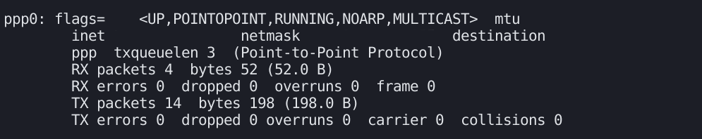

# Week 3

On the third week my responsibilites were:
-   Fix issues on Serial library
-   SSH connection over VSCode
-   Process the responses from the modem
-   Basic test
-   Week 2 report
  
and all these are studied well. Report related to these titles can be found below.

# SSH Connection
For this step following instructions had been applied:

1. Install "Remote SSH" extension on your local development environment. 
2. On your Raspberry Terminal hit the command below:
	```
	ifconfig
	```
	-> From "*wlan0*" get your IP address where "*inet*"to set the connection.
3. Get your username with:
	```
	whoami
	```
4. Then on your VSCode extension add a new SSH with:
	```
	ssh your_username@your_beloved_ip_address
	```
5. On configuration select home/...
6. After refreshing you can able to see your connection address and connect.
7. If you get an error while connecting please check your RaspberryPi configurations about SSH. It has to be enabled.

> [Remote SSH Tutorial](https://singleboardblog.com/coding-on-raspberry-pi-remotely-with-vscode/)

# Serial Library and Config
I started with errors throughout the first sending message 'Hello' with using serial library. Here is my error:

> TypeError: unicode strings are not supported, please encode to bytes: 'Hello'

To fix this replace this:
		```
		sender.write('Hello')
	```
    
  with this:
  		```
		sender.write(str.encode('Hello'))
	```

When you run this code output will be blank. Why?
Because word 'Hello' is not meaningful for the system that we're trying to communicate.

# Deep Inside AT Commands

 AT: 
 - Tests communication between GSM and device

AT+CGMI:
 - Returns manufacturer identificaiton of the GSM module

AT+CGMM:
 - Returns model identificaiton of the GSM module
 
AT+CGSN:
 - Returns product serial number of the GSM module

AT+CSQ:
 - Queries the received signal strength

AT+CREG:
 - Checks network registration status

AT+CGATT:
 - Checks GPRS registration status

AT+CGDCONT:
 - Checks current GPRS context settings

AT+CIFSR:
 - Queries assigned IP address of the GSM module

AT+UHTTP:
 - Set the HTTP base url and custom headers

AT+UDWNFILE:
 - Generate a JSON file containing the data you want to send

AT+UHTTPC:
 - Send data

> [AT Commands #1](https://www.engineersgarage.com/at-commands-gsm-at-command-set/)
>  [AT Commands #2](https://docs.monogoto.io/developer-zone/cloud-integrations/ubidots#send-data-using-http)

And here is the basic python code for the run AT commands without using your terminal:
```
import serial

sender = serial.Serial("/dev/ttyUSB3", 115200, timeout=5)

try:
	sender.write(b'AT+CGMI\r')
finally:
	response = sender.read(50) # read up 50 bytes
	print("Received response:", response)
	sender.close() # close the serial communication
```
For my case modem is connected at ttyUSB3. In a try-finally block I wrote my message which was an AT command to return manufacturer identification. 
b stands for *bytes*. Commands string must be encoded as bytes. 
In serial communication '\r' is an escape sequence that represents carriage return. Denotes the end of the line. If you remove it code won't work. I couldn't get the most reasonable answer for that but according to my experience with AT commands, for the nature of them this emerges.   

> Besides with importing the *time* library, sleep time can be added between writing and reading. That will make the code more stable on serial communication.


# PPP Connection and Requests
Earlier week I have installed PPP. Installation was successfull. But this week when I started system and checked status with using:
```
sudo systemctl status ppp_connection_manager.service
```
```
sudo systemctl start ppp_connection_manager.service
```
I got the following error:

> Job for ppp_connection_manager.service failed because the control process exited with error code. See "systemctl status ppp_connection_manager.service" and "journalctl -xe" for details.

For status:

> ppp_connection_manager.service - PPP Connection Manager
> Loaded: loaded (/etc/systemd/system/ppp_connection_manager.service; enabled; vendor preset: enab>
> Active: failed (Result: exit-code) 


For journalctl -xe:
>  Support: https://www.debian.org/support
Documentation: ...(3)
A new session with the ID ... has been created for the user ....
The leading process of the session is ....
Subject: A start job for unit session-....scope has finished successfully
Defined-By: ...
Support: https://www.debian.org/support
A start job for unit session-....scope has finished successfully.
The job identifier is ....

To solve:

 1. Check Restart value with:
	```
	systemctl cat ppp_connection_manager.service
	```
 2. If Restart=always, replace value with Restart=on-abnormal:
	```
	systemctl edit ppp_connection_manager.service
	```
	-> You might need sudo privileges.
	
3. Or, just do not forget to use:
	```
	sudo pon
	```
After this phase with:
	```
	ifconfig
	```
make sure from *ppp0*.


Then ping it as:
		```
		ping -I ppp0 -c 5 somewebsite.com
		```

 - ping: to test the reachability of a network host, send ICMP ECHO_REQUEST packets to network hosts
 - -I ppp0: use ppp0 network Interface when sending packages
 - -c 5: number of echoes

> [Explain Shell](https://explainshell.com)
>  [Ping](https://www.lancom-systems.com/docs/LCOS/Refmanual/EN/topics/aa1066622.html)

#### To stop ModemManager:
```
sudo systemctl stop ModemManager  
sudo systemctl disable ModemManager
```

First of all over PPP, HTTP GET and POST requests must be send. To achieve this task:
		```
	pip install requests
	```
	```
	import requests
	```

### AT Commands to Send Data Using HTTP
As we mentioned earlier at the AT Commands title, last three command are our main commands to communicate.


