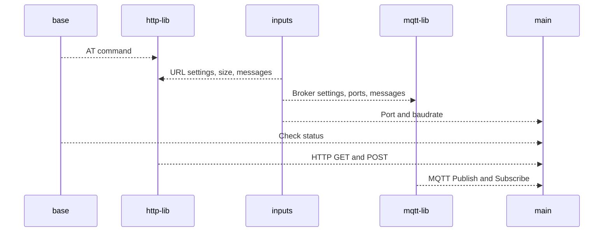

# User Guideline

This project includes HTTP GET and POST requests, MQTT Subscribe and Publish processes over AT commands to control the GSM modules. Aim to understand cellular connections and communication over the modem.


# Files

This project includes 5 essential files that:

 1. base.py
 2. http-lib.py
 3. mqtt-lib.py
 4. main.py
 5. inputs.py
 

## base.py
```
class Communication:
	def at_command(self, at_command, explanation)
	def check_base(self)
	def define_PDP_context(self)
	def reboot_options(self)
```

#### at_command(at_command, explanation)
To run commands and enter inputs on the terminal this basic function pops out. Over serial library of python able to write and read. Takes two variable as command and command's explanation. With that when command executed understanding which command is executed is more reachable.

> \r is a **carriage return** which often means that the cursor should move to the leftmost column
---
#### check_base()
Before processes connection must have been established. To check following command returnings are essential.
```
AT+CPIN? 
> +CPIN: READY OK (password not required)

AT+CREG?
> +CREG: 0,1 OK (disable, established)

AT+CGREG?
> +CGREG: 0,1 OK (disable, established)

AT+COPS?
> +COPS ... (operation info)
```
---
#### define_PDP_context()
This function is for further processes. If PDP context activation raises an error, this function can be executed. 

```
Enter your APN: super
Enter your IP: IP (or IPv6)
```

Packet Data Protocol (PDP) context is **a data structure that allows the device to transmit**. **data using Internet Protocol**

---
#### reboot_options()
PPP and QMI protocolos require to set usb modes. From usbnet 1 is for ECM and 0 is for PPP and QMI. To check the status and change this function can be executed.


## http-lib.py
```
class HTTP:
	def config(self)
	def QHTTPCFG_settings(self)
	def set_PDP(self)
	def connect(self)
	def http_get(self)
	def http_post(self)
	def destroyer_of_http(self)
```
#### config()
Sets **contextID** and **responseheader**. 
In general, the use of a `contextID` or any other unique identifier depends on the specific application or system and its implementation.
**Responseheader hold additional information about the response, like its location or about the server providing it**. Representation headers. Contain information about the body of the resource, like its MIME type, or encoding/compression applied.

Packet Data Protocol (PDP) context is **a data structure that allows the device to transmit**. **data using Internet Protocol**

---
#### QHTTPCFG_settings()
More options as in documentation, can be selected via this function.

---
#### connect()
URL can be setted with given url length and address. URL can be changed from **inputs.py**

---
#### http_get()
Requires size of the GET request and read. These values are related to the response that user wants to get from the server. Values can be changed from **inputs.py**

---
#### http_post()
Requires POST value size, latency time and message for the server. Message can be taken via input but other values must be changed via **inputs.py**

---
#### destroyer_of_http()
Proccess can be stopped and connection can be terminated. Stops all HTTP process.

## mqtt-lib.py
```
class MQTT:
	def connect(self)
	def subscribe(self)
	def publish(self)
```
#### connect()
Requires receiving mode, broker, port and client for the server. Message can be taken via input but other values must be changed via **inputs.py**

---
#### subscribe()
Requires QoS (Quality of Service), broker, port and client for the server. Message can be taken via input but other values must be changed via **inputs.py**

---
#### publish()
Requires publish topic, message length and message for the server. Message can be taken via input but other values must be changed via **inputs.py**

---

## main.py
```
class Execute:
	def control_base(self)
	def http_get(self)
	def http_post(self)
	def mqtt_sub(self)
	def mqtt_pub(self)
```
This file includes all process that:

 1. Checks base status
 2. Sends HTTP GET request
 3. Sends HTTP POST request
 4. Subscribe to a topic (MQTT)
 5. Publish a topic (MQTT)

To run your desired process inside main function:
```
if __name__ == "__main__":
    modem = serial.Serial(var.port, var.baudrate, timeout=5)

    exc = Execute()
    # Check
    exc.control_base()

    # HTTP
    exc.http_get()

    # MQTT
    exc.mqtt_pub()

	# Close the modem connection
    modem.close()
```

## UML Diagram of src


